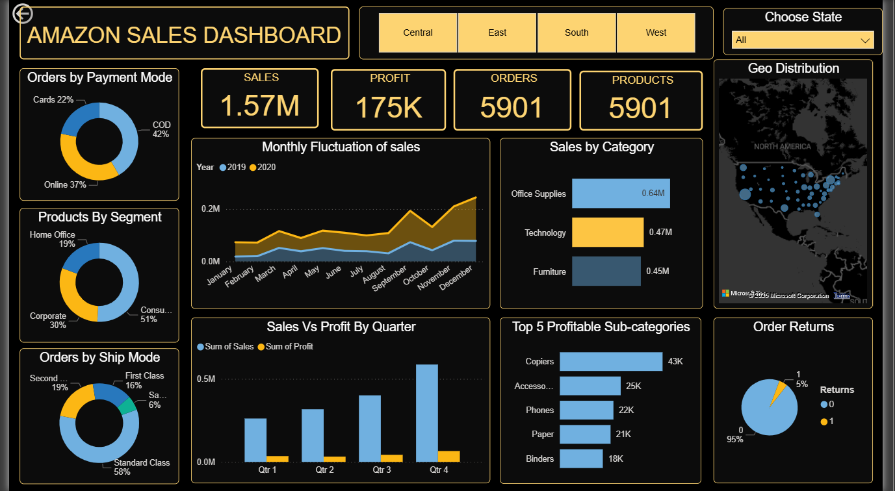
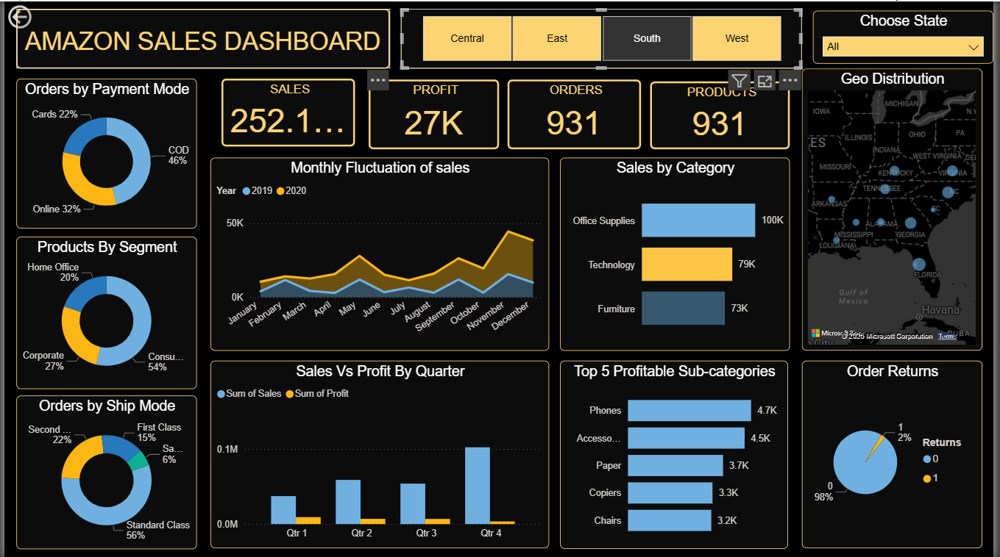
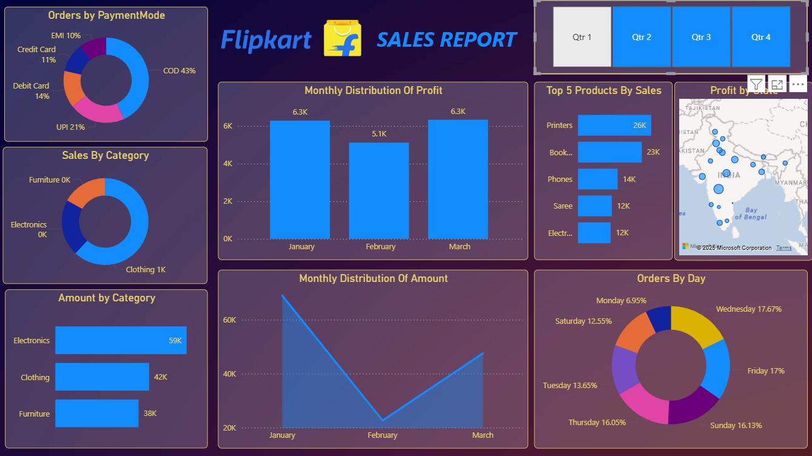

# Power BI Business Dashboards – E-commerce Sales Analysis

## Overview
This repository contains multiple Power BI dashboards built to analyze e-commerce sales performance and support data-driven business decisions.

The dashboards focus on understanding revenue trends, customer behavior, product performance, and regional insights.

## Dashboards Included
1. Amazon Sales Analytics Dashboard   
2. Flipkart Sales Performance Dashboard   
3. Madhav E-commerce Sales Dashboard

## Primary Dashboard – Amazon Sales Analytics

This repository primarily showcases the Amazon Sales Analytics Dashboard.
The dashboard focuses on:
- Overall sales, profit, and order performance
- Monthly sales and profit trends
- Regional and state-wise analysis
- Customer segments and payment method preferences
- Category and sub-category performance
- Identification of high-performing and low-performing areas for business decisions

  ### Amazon Dashboard Preview

## Secondary Dashboard – Flipkart Sales Performance

The Flipkart dashboard provides additional insights into e-commerce sales patterns and complements the primary Amazon analysis.

Key focus areas include:
- Category-wise sales performance
- Payment method preferences
- State-wise order distribution
- Identification of strong and weak sales segments

### Flipkart Dashboard Preview

## Business Problems Addressed
- Identifying top-performing product categories
- Analyzing sales and profit trends over time
- Understanding regional performance
- Evaluating payment method preferences
- Supporting strategic decision-making through KPIs

## Tools Used
- Power BI (Data Modeling, DAX, Interactive Visuals)
- Microsoft Excel (Data Cleaning & Preprocessing)

## Key Insights
- Electronics and Office Supplies emerged as high-revenue categories
- Cash on Delivery remains a dominant payment method
- Certain states consistently outperform others in revenue and order volume
- Clear seasonal and monthly sales patterns were identified

## Files in this Repository
- Power BI dashboard files (.pbix)
- Excel datasets (.xlsx)
- Dashboard screenshots

## Outcome
These dashboards demonstrate the ability to transform raw data into clear, actionable insights using Power BI and business-focused analytics.

